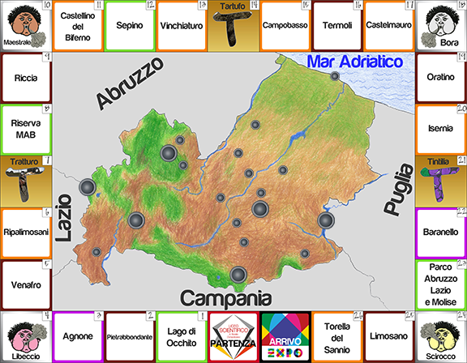

## [🏆 National Competition Winner](http://www.ansa.it/molise/notizie/2015/05/24/gioco-delloca-in-chiave-molisana_0bd04e70-8487-475a-a7ed-bc67d2b0e438.html)
The Scientific Lyceum "A.Romita" of Campobasso
presented at the [Milan EXPO 2015](https://en.wikipedia.org/wiki/Expo_2015). This videogame was made
in order to share the traditions of the region of Molise, Italy. The game narrates the past through a modern
medium, with the goal of sharing local culture with a videogame.

## Main Board

## Before you compile

In order to play the game download,extract and add [this rar file](https://drive.google.com/open?id=1tiRANkaawlPL7cTxHsJwYtwg6FK2jLDv) to the root folder of the project.
